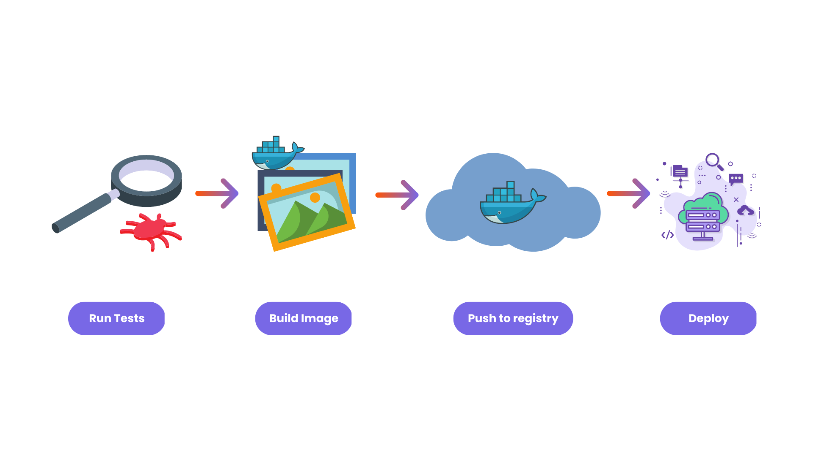
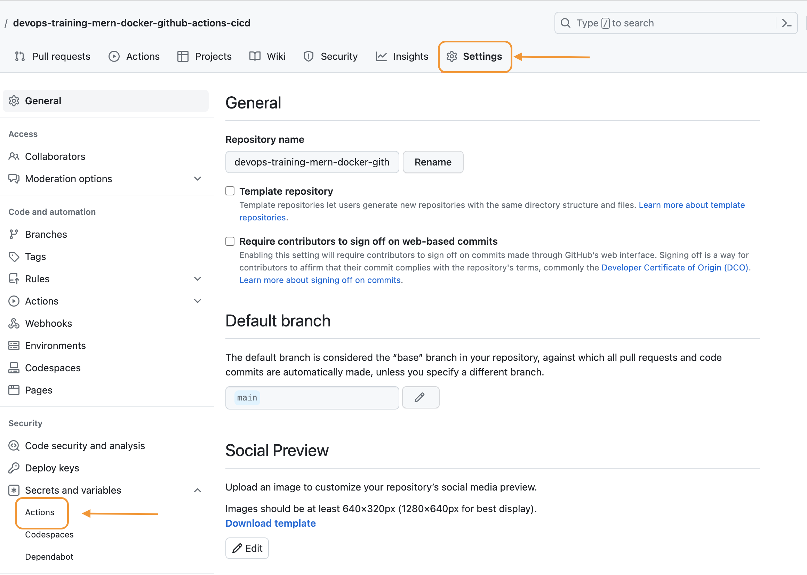
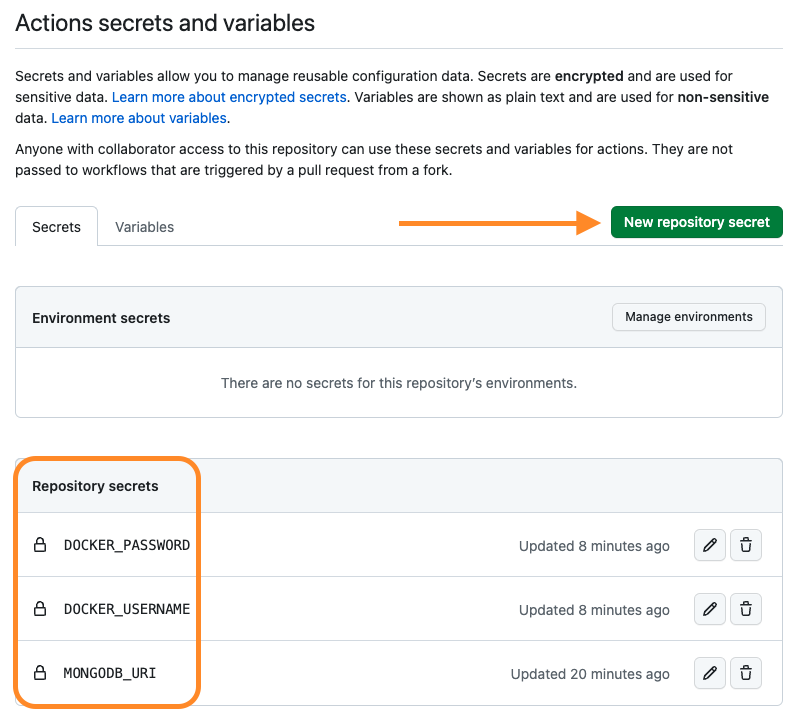

# Automate MERN App Deployment with GitHub Actions CI/CD

Date Added: September 21, 2022 12:09 PM


<aside>
💡 This template documents how to review code. Helpful for new and remote employees to get and stay aligned.

</aside>

# **What is CI/CD and Why it's Important?**

**Continuous integration and continuous delivery (CI/CD)** is a set of practices that automates the software development and delivery process. CI/CD is essential to DevOps, which is a culture and set of practices that emphasizes collaboration and communication between developers, testers, and operations professionals.



**CI/CD** is needed to automate our MERN app's development to deployment workflow, which currently consists of four manual stages: testing, building Docker images, pushing to a registry, and deploying to a cloud provider. This will significantly improve developer productivity, as this workflow must be performed every time a new feature is added or a bug is fixed.

# **What is "GitHub Actions"?**

A CI/CD server is needed to run a CI/CD pipeline, which is where all of the steps in a pipeline are executed. There are many CI/CD services available, including Jenkins, Travis CI, Circle CI, GitLab CI/CD, AWS CodePipeline, Azure DevOps, and Google Cloud Build. I chose GitHub Actions because it is natively integrated with Git, works well with GitHub, and is very easy to use. It is also sufficient for small and medium-sized applications like ours. For more complex applications, you can use any of the other services listed above.

## **How do GitHub Actions work?**

GitHub Actions is not a CI/CD platform, but rather a tool that can be used to implement CI/CD pipelines.

### **Events**

Workflows can be triggered by events such as pull requests, pushes, pull request merges, issue creation, and more. For example, you can create a workflow that triggers a bot to say "Thanks for opening the issue, our maintainers will review it" whenever an issue is created.

### **Workflows**

Workflows are YAML files that define the steps to be executed after an event is triggered. Workflow files are typically kept in the `.github/workflows/` directory.

### **Jobs**

A job is a group of steps called a job. Each workflow must include at least one job. A job consists of a set of steps that need to be executed in a virtual environment.

### **Runners**

This is my favorite feature of GitHub Actions. Runners are virtual environments where jobs are carried out. You can either use [GitHub-hosted runners](https://docs.github.com/en/actions/using-github-hosted-runners/about-github-hosted-runners#supported-runners-and-hardware-resources) that contains pre-installed packages or host your own.


# Adding a CI/CD Pipeline to the MERN App

## Prerequisites

- Get source code from [here](https://github.com/itsrakeshhq/productivity-app) if haven't followed previous tutorials in this series.
- Read previous articles in this series so that you won't get confused.
- Basic YAML understanding.
- GitHub account.

To begin, we must define pipeline configurations in a YAML file. Where should I save this YAML file? - If you're familiar with GitHub, you've probably heard of the `.github` directory, which is a special directory used for GitHub-specific items such as issue templates, pull request templates, workflow files, and so on. So we must place our pipeline file in the `workflows` folder, which is located in the `.github` folder.

Go ahead and create a YAML file and name it something like `pipeline.yml` or `pipeline.yaml`. Your folder structure should now look like this:

```bash
.
└── my-project/
    ├── .github/
    │   └── workflows/
    │       └── pipeline.yml
    ├── ui/
    ├── api/
    ├── Dockerfile
    └── docker-compose.yml

```

First, we have to mention the name of the workflow.

```yaml
name: Build and Deploy
```

Then, mention a trigger - on commit/on push/on pull request, etc.., along with branches.

```yaml
on:
  push:
    branches:
      - main
```

Since our application uses some environment variables while running tests, we have to set environment variables in the YAML file that will be used by workflow steps.

But, first, let's add environment variables in the GitHub repository. To do so, go to repository **Settings** -> expand **Secrets and variables** -> **Actions**.



Click on **New repository secret** and add the following secrets.



Now in the YAML file, you can access them like this:

```yaml
env:
  MONGODB_URI: ${{ secrets.MONGODB_URI }}
  TOKEN_KEY: ${{ secrets.TOKEN_KEY }}
  EMAIL: ${{ secrets.EMAIL }}
  PASSWORD: ${{ secrets.PASSWORD }}
```

Let's get to the interesting part! These are the only steps we have to perform with GitHub Actions. As simple as that.


Start by adding jobs, let's add a job called `build-and-deploy`.

```yaml
jobs:
  build-and-deploy:
    # This is telling GitHub to run the workflow on the latest version of Ubuntu.
    runs-on: ubuntu-latest
```

## **Adding Continuous Integration**

In this job, let's add steps to pull code from the repo and run some tests.

```yaml
steps:
      # Checkout the code from the GitHub repository
      - name: Checkout code
        uses: actions/checkout@v3

      # Install dependencies and run tests for the client application
      - name: Install Client
        working-directory: ./ui
        run: |
          npm install
          npm run build

      # Install dependencies, export environment variables to be used by application and run tests for the server application
      - name: Install Server
        working-directory: ./api
        run: |
          npm install
          npm run build
          export MONGODB_URI=$MONGODB_URI
```

- `name` - You can provide a name for each step.
- `uses` - Set which action to use. `checkout` is a pre-defined action provided by GitHub that checks out a repo
- `working-directory` - Set working directory. This is where all the commands mentioned in that step will run.
- `run` - Run commands. You can run multiple commands by putting `|` (**pipe**). Learn more about YAML in [this](https://youtu.be/IA90BTozdow) YouTube tutorial.

Now if you push these changes to GitHub. It will automatically run your workflow. You can see the running workflow in the **Actions** tab of your GitHub repository.

Click on the commit and then the job to see the running steps.

## **Adding Continuous Deployment**

Now it's time to build docker images and push them to the docker hub.

```yaml
			# Build a Docker image for the client application
      - name: Build Client Docker Image
        working-directory: ./ui
        # Build image with tag thiendang/devops-training-mern-docker-github-actions-cicd:client
        run: |
          docker build -t thiendang/devops-training-mern-docker-github-actions-cicd:ui-${{github.run_number}} -t thiendang/devops-training-mern-docker-github-actions-cicd:ui-latest .

      # Build a Docker image for the server application
      - name: Build Server Docker Image
        working-directory:
          ./api
          # Build image with tag thiendang/devops-training-mern-docker-github-actions-cicd:api
        run: |
          docker build -t thiendang/devops-training-mern-docker-github-actions-cicd:api-${{github.run_number}} -t thiendang/devops-training-mern-docker-github-actions-cicd:api-latest .

      # Log in to Docker Hub using credentials from repository secrets
      - name: Log in to Docker Hub
        uses: docker/login-action@v2
        with:
          username: ${{ secrets.DOCKER_USERNAME }}
          password: ${{ secrets.DOCKER_PASSWORD }}

      # Push the Docker images to Docker Hub
      - name: Push Docker Images to Docker Hub
        run: |
          docker push thiendang/devops-training-mern-docker-github-actions-cicd:ui-${{github.run_number}}
          docker push thiendang/devops-training-mern-docker-github-actions-cicd:api-${{github.run_number}}
```

- Before pushing to the docker hub we need to log into the hub. That's why there's a step before pushing images. With `with` we can use secrets directly without setting them in the environment.
- `github.run_number` - This is because it's a good practice to give a unique identifier for every image on the hub. And this environment variable (`run_number`) will be generated automatically by GitHub Actions.

Here's the complete YAML file.

```yaml
name: Build and Deploy

# Run the workflow when code is pushed to the main branch
on:
  push:
    branches:
      - main

# Set environment variables
env:
  MONGODB_URI: ${{ secrets.MONGODB_URI }}

# This is the workflow that is being run.
jobs:
  build-and-deploy:
    # This is telling GitHub to run the workflow on the latest version of Ubuntu.
    runs-on: ubuntu-latest
    steps:
      # Checkout the code from the GitHub repository
      - name: Checkout code
        uses: actions/checkout@v3

      # Install dependencies and run tests for the client application
      - name: Install Client
        working-directory: ./ui
        run: |
          npm install
          npm run build

      # Install dependencies, export environment variables to be used by application and run tests for the server application
      - name: Install Server
        working-directory: ./api
        run: |
          npm install
          npm run build
          export MONGODB_URI=$MONGODB_URI

      # Build a Docker image for the client application
      - name: Build Client Docker Image
        working-directory: ./ui
        # Build image with tag thiendang/devops-training-mern-docker-github-actions-cicd:client
        run: |
          docker build -t thiendang/devops-training-mern-docker-github-actions-cicd:ui-${{github.run_number}} -t thiendang/devops-training-mern-docker-github-actions-cicd:ui-latest .

      # Build a Docker image for the server application
      - name: Build Server Docker Image
        working-directory:
          ./api
          # Build image with tag thiendang/devops-training-mern-docker-github-actions-cicd:api
        run: |
          docker build -t thiendang/devops-training-mern-docker-github-actions-cicd:api-${{github.run_number}} -t thiendang/devops-training-mern-docker-github-actions-cicd:api-latest .

      # Log in to Docker Hub using credentials from repository secrets
      - name: Log in to Docker Hub
        uses: docker/login-action@v2
        with:
          username: ${{ secrets.DOCKER_USERNAME }}
          password: ${{ secrets.DOCKER_PASSWORD }}

      # Push the Docker images to Docker Hub
      - name: Push Docker Images to Docker Hub
        run: |
          docker push thiendang/devops-training-mern-docker-github-actions-cicd:ui-${{github.run_number}}
          docker push thiendang/devops-training-mern-docker-github-actions-cicd:api-${{github.run_number}}
```